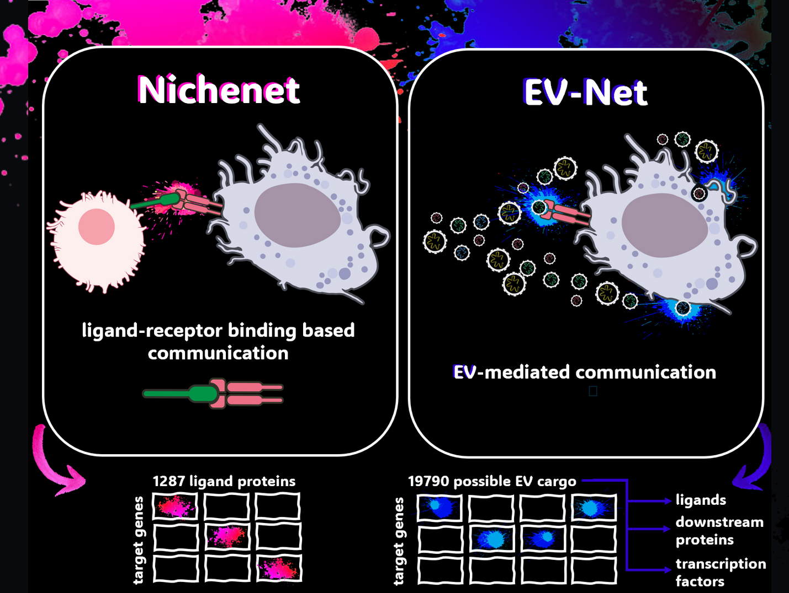
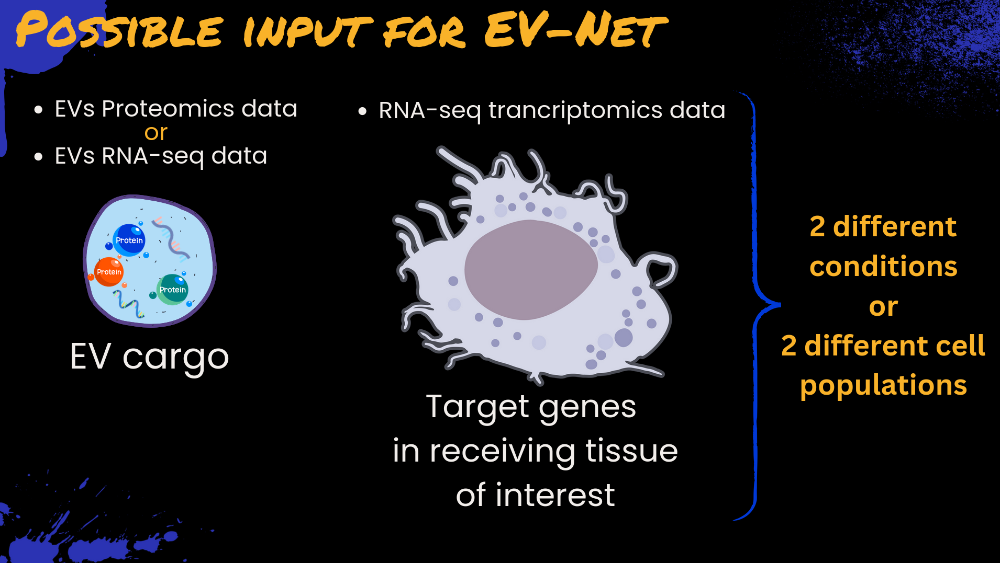

---
output:
  github_document:
    html_preview: true
---

<!-- README.md is generated from README.Rmd. Please edit that file -->

<!-- github markdown built using
rmarkdown::render("README.Rmd",output_format = "md_document")
-->

# EV-Net

<!-- badges: start -->
<!-- badges: end -->
  

**EV-Net: A modification of the NicheNet method for extracellular vesicles-mediated intercellular communication.** EV-Net enables the exploration of the effect of the extracellular vesicles (EVs) cargo in receiving tissues of interest.


## Installation of nichenetr

Installation typically takes a few minutes, depending on the number of
dependencies that has already been installed on your PC. You can install
EV-Net (and required dependencies) from github with:

```{r gh-installation, eval = FALSE}
if(!requireNamespace("devtools", quietly = TRUE)) {
  install.packages("devtools") 
}

devtools::install_github("torrejoNIa/EV-Net")
```

EV-Net was tested on both Windows and Linux (most recently tested R version: R 4.4.3)

## Overview of EV-Net
<details>
<summary><h3>Background</h3></summary>

Extracellular vesicles (EVs) are small, bilayered vesicles that carry diverse bioactive molecules such as nucleic acids, proteins, and lipids. These vesicles play a crucial role in cell-to-cell communication, but their importance is often overlooked in communication network models. In addition to that, current tools available for studying these networks are not designed to handle EV-specific data.

To address this challenge, we adapted Nichenet (Browaeys et al., 2020), an existing framework for cell-to-cell communication exploration, for its use on EVs datasets. 

Originally, NicheNet was designed to analyze cell-to-cell communication by identifying ligands driving gene expression changes via ligand-receptor interactions. Since EVs can also deliver cargo through mechanisms beyond ligand-receptor interactions, such as membrane fusion and endocytosis, since EVs can be internalized by recipient cells via additional mechanisms beyond ligand-receptor interactions, such as membrane fusion and endocytosis, we modified NicheNet for its use on EVs. This modification expanded the tool’s scope to include not only ligands, but also dowsntream proteins proteins and transcription factors, ensuring a more comprehensive analysis of EV-mediated communication.
<br><br>
{width=450}
<br><br>

NicheNet utilizes a Personalized PageRank algorithm to generate a ligand-to-target scoring matrix. This process involves random walk restarts using each ligand as a seed node to obtain the scoring for each ligand-target diffusion. To tailor this method to our needs, we modified it and applied the algorithm to not only ligands, but also the intermediary signaling proteins and transcription factors. This modification generated a new protein-to-target matrix comprising 19 790 proteins (spanning ligands, downstream proteins and transcription factors) and 22 521 target genes. This new  protein-to-target matrix replaced the original Nichenet ligand-to-target matrix, which only contained 1287 ligands and 22521 target genes.

</details>

<details>
<summary><h3>Main functionalities of EV-Net</h3></summary>

* Assessing the effect of the EV cargo (EVs proteomics, or RNA-seq data) in gene expression in the receiving cell population (when comparing two different conditions)
* Assessing the potential effect of the EV cargo (proteomics, or RNA-seq data) in a receiving tissue of interest (1 condition)
* Prioritizing EV cargo (proteins) based on their effect on gene expression
* Inferring putative EV cargo-target links active in the system under study
* Inferring potential signaling paths between EV cargo and target genes of interest: to generate causal hypotheses and check which data sources support the predictions

Moreover, we provide instructions on how to make intuitive visualizations of the EV cargo - target relantion ships

<br><br>

</details>

As input to EV-Net, users must provide EV cargo of interest (differentially abundant proteomics or differentially expressed RNA-seq data obtained from EVs) and single-cell or sorted bulk data from the receiving tissue of interest, from human or mouse. As output, EV-Net returns the ranking of EV cargo that best explain the changes in receiver tissue expression (when two conditions are compared) or the ranking of EV cargo with a higher effect in the receiving tissue, together with candidate target genes with high potential to be regulated by these EV cargo. 


<br><br>


## Learning to use nichenetr

The following vignettes contain the explanation on how to perform a basic EV-Net analysis. We present three different use cases, each using slightly different inputs, but all with the goal of studying the effct of EV cargo in the respective tissue of interest

* [Use case 1: Effect of gut EVs in KC (Tabula Muris Atlas)](vignettes/Use_case_1_Effect_of_gut_EVs_in_KC_TabulaMurisAtlas.Rmd):`vignette("use case 1", package="EV-Net")`

</details>

## References

Browaeys, R., Saelens, W. & Saeys, Y. NicheNet: modeling intercellular communication by linking ligands to target genes. Nat Methods (2019) doi:10.1038/s41592-019-0667-5
