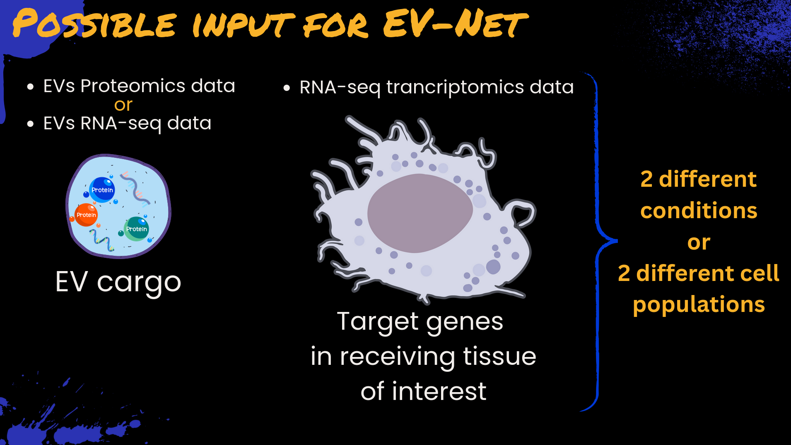

<!-- README.md is generated from README.Rmd. Please edit that file -->
<!-- github markdown built using
rmarkdown::render("README.Rmd",output_format = "md_document")
-->

# EV-Net

<!-- badges: start -->
<!-- badges: end -->

**EV-Net: A modification of the NicheNet method for extracellular
vesicles-mediated intercellular communication.** EV-Net enables the
exploration of the effect of the extracellular vesicles (EVs) cargo in
receiving tissues of interest.

## Installation of nichenetr

Installation typically takes a few minutes, depending on the number of
dependencies that has already been installed on your PC. You can install
EV-Net (and required dependencies) from github with:

    if(!requireNamespace("devtools", quietly = TRUE)) {
      install.packages("devtools") 
    }

    devtools::install_github("torrejoNIa/EV-Net")

EV-Net was tested on both Windows and Linux (most recently tested R
version: R 4.4.3)

## Overview of EV-Net

<h3>
Background
</h3>

Extracellular vesicles (EVs) are small, bilayered vesicles that carry
diverse bioactive molecules such as nucleic acids, proteins, and lipids.
These vesicles play a crucial role in cell-to-cell communication, but
their importance is often overlooked in communication network models. In
addition to that, current tools available for studying these networks
are not designed to handle EV-specific data.

To address this challenge, we adapted Nichenet (Browaeys et al., 2020),
an existing framework for cell-to-cell communication exploration, for
its use on EVs datasets.

Originally, NicheNet was designed to analyze cell-to-cell communication
by identifying ligands driving gene expression changes via
ligand-receptor interactions. Since EVs can also deliver cargo through
mechanisms beyond ligand-receptor interactions, such as membrane fusion
and endocytosis, since EVs can be internalized by recipient cells via
additional mechanisms beyond ligand-receptor interactions, such as
membrane fusion and endocytosis, we modified NicheNet for its use on
EVs. This modification expanded the tool’s scope to include not only
ligands, but also dowsntream proteins proteins and transcription
factors, ensuring a more comprehensive analysis of EV-mediated
communication.   

  

NicheNet utilizes a Personalized PageRank algorithm to generate a
ligand-to-target scoring matrix. This process involves random walk
restarts using each ligand as a seed node to obtain the scoring for each
ligand-target diffusion. To tailor this method to our needs, we modified
it and applied the algorithm to not only ligands, but also the
intermediary signaling proteins and transcription factors. This
modification generated a new protein-to-target matrix comprising 19 790
proteins (spanning ligands, downstream proteins and transcription
factors) and 22 521 target genes. This new protein-to-target matrix
replaced the original Nichenet ligand-to-target matrix, which only
contained 1287 ligands and 22521 target genes.

<h3>
Main functionalities of EV-Net
</h3>

-   Assessing the effect of the EV cargo (EVs proteomics, or RNA-seq
    data) in gene expression in the receiving cell population (when
    comparing two different conditions)
-   Assessing the potential effect of the EV cargo (proteomics, or
    RNA-seq data) in a receiving tissue of interest (1 condition)
-   Prioritizing EV cargo (proteins) based on their effect on gene
    expression
-   Inferring putative EV cargo-target links active in the system under
    study
-   Inferring potential signaling paths between EV cargo and target
    genes of interest: to generate causal hypotheses and check which
    data sources support the predictions

Moreover, we provide instructions on how to make intuitive
visualizations of the EV cargo - target relantion ships

  

As input to EV-Net, users must provide EV cargo of interest
(differentially abundant proteomics or differentially expressed RNA-seq
data obtained from EVs) and single-cell or sorted bulk data from the
receiving tissue of interest, from human or mouse. As output, EV-Net
returns the ranking of EV cargo that best explain the changes in
receiver tissue expression (when two conditions are compared) or the
ranking of EV cargo with a higher effect in the receiving tissue,
together with candidate target genes with high potential to be regulated
by these EV cargo.

   

## Learning to use nichenetr

The following vignettes contain the explanation on how to perform a
basic EV-Net analysis. We present three different use cases, each using
slightly different inputs, but all with the goal of studying the effct
of EV cargo in the respective tissue of interest

-   [Use case 1: Effect of gut EVs in KC (Tabula Muris
    Atlas)](vignettes/Use_case_1_Effect_of_gut_EVs_in_KC_TabulaMurisAtlas.Rmd):`vignette("use case 1", package="EV-Net")`

## References

Browaeys, R., Saelens, W. & Saeys, Y. NicheNet: modeling intercellular
communication by linking ligands to target genes. Nat Methods (2019)
<doi:10.1038/s41592-019-0667-5>
